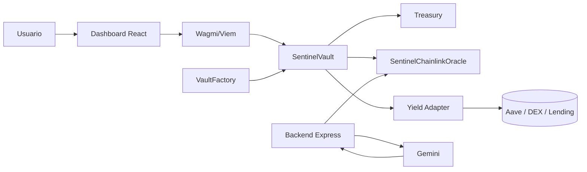
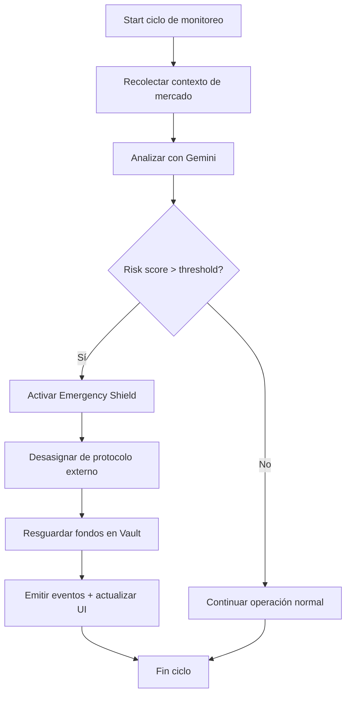
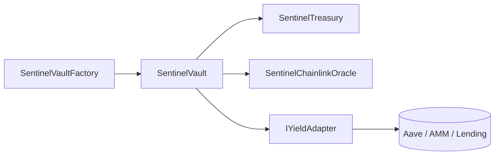

# 🛡️ Sentinel Vault: AI-Powered DeFi Risk Management

**Sentinel Vault** es una infraestructura de vanguardia diseñada para la protección de activos en el ecosistema DeFi. Utiliza Inteligencia Artificial generativa (Google Gemini) para actuar como un oráculo de riesgo dinámico, protegiendo los depósitos de los usuarios ante volatilidades extremas o fallos en los protocolos subyacentes.

---

## 🌟 Visión y Propósito
En el panorama DeFi actual, los riesgos de mercado (desanclaje de stablecoins, exploits de liquidez, caídas del 99%) ocurren en minutos. Los modelos de riesgo tradicionales son estáticos. **Sentinel Vault** introduce una capa reactiva que:
1.  **Analiza** datos del mercado en tiempo real mediante IA.
2.  **Anticipa** crisis antes de que afecten el capital.
3.  **Ejecuta** defensas on-chain (Safe Withdraw) automáticamente.

---

## 🚀 Características Principales
-   **AI Risk Oracle**: Motor basado en Gemini 1.5 que procesa feeds de datos y emite scores de riesgo (0-100).
-   **Automated Emergency Shield**: Si el riesgo > 80, el contrato retira automáticamente los activos del yield-source y los resguarda en el Vault.
-   **Multi-Asset Treasury**: Gestión centralizada de yields y fees para sostenibilidad del protocolo.
-   **Dashboard Multi-Red (Base)**: Visualización de métricas de riesgo, balances y estado en **Base Mainnet** y **Base Sepolia**.
-   **Gas Optimized**: Contratos escritos con patrones de optimización de gas (Custom Errors, slot packing).

---

## 🛠️ Stack Tecnológico
-   **Smart Contracts**: Solidity 0.8.24, Hardhat/Foundry, OpenZeppelin.
-   **Frontend**: React 18, Vite, Tailwind CSS, Lucide Icons.
-   **Web3**: Wagmi v2, Viem, ConnectKit.
-   **Backend/Oracle**: Express.js, TypeScript, Google Generative AI SDK (@google/genai).

---

## 💻 Guía de Implementación Local

### 1. Requisitos Técnicos
-   **Node.js**: v18.0.0 o superior.
-   **Wallet**: Metamask o similar con configuración para **Base Mainnet** y/o **Base Sepolia**.
-   **Faucet**: Obtén tokens de prueba en [Base Faucet](https://www.coinbase.com/faucets/base-ethereum-sepolia-faucet).

### 2. Instalación
```bash
# Clonar repositorio
git clone <repo-url>
cd Sentinel

# Instalar dependencias
npm install
```

### 3. Configuración de Entorno
Crea un archivo `.env` en la raíz del proyecto. **Es obligatorio** contar con una API Key de Gemini:
```env
# Claves de IA (Google Gemini)
GEMINI_API_KEY=""
VITE_GEMINI_API_KEY=""

# Configuración de Oráculo
ORACLE_PRIVATE_KEY=""
VITE_ADMIN_ADDRESS="0x0000..."

# Web3 / Conectividad
VITE_WALLETCONNECT_PROJECT_ID=""
```

### 4. Ejecución
```bash
# Iniciar servidor Full-Stack (Frontend + Backend API)
npm run dev
```
La aplicación estará disponible en `http://localhost:3000`.

### 5. Scripts útiles
```bash
# Desarrollo (frontend + API Express)
npm run dev

# Build de frontend + verificación de tipos TypeScript
npm run build

# Ejecutar en modo producción
npm run start

# Preview del build de Vite
npm run preview

# Deploy de contratos en Base Sepolia
npx hardhat run scripts/deploy.ts --network baseSepolia

# Deploy de contratos en Base Mainnet
npx hardhat run scripts/deploy.ts --network base
```

---

## ☁️ Despliegue en Vercel (Front + Back)

Vercel permite desplegar Sentinel Vault de forma robusta. Al ser una aplicación Full-Stack (Vite + Express), utilizamos las funciones Serverless de Vercel para el Oráculo de IA.

### Paso 1: Preparación del Repositorio
Asegúrate de que el archivo `vercel.json` esté en la raíz para direccionar correctamente las rutas del API al servidor Express.

### Paso 2: Importar en Vercel
1.  Ve a [Vercel Dashboard](https://vercel.com/dashboard) y haz clic en **Add New** > **Project**.
2.  Importa tu repositorio de GitHub.

### Paso 3: Configuración de Variables de Entorno (DETALLE ALTO)
Este es el paso más crítico. En la pestaña **Environment Variables**, añade:

| Variable | Descripción | Valor Ejemplo |
| :--- | :--- | :--- |
| `GEMINI_API_KEY` | Clave secreta de Google AI Studio | `AIzaSy...` |
| `VITE_BASE_RPC_URL` | RPC para Base Mainnet | `https://mainnet.base.org` |
| `VITE_BASE_SEPOLIA_RPC_URL` | RPC para Base Sepolia | `https://sepolia.base.org` |
| `DEPLOYER_PRIVATE_KEY` | Key para interactuar con contratos (opcional en front) | `0x...` |
| `VITE_BASE_SEPOLIA_FACTORY_ADDRESS` | Dirección del Vault Factory (Base Sepolia) | `0xEC8B2c8f60DDe002349d85d51E218FC51DCe2a20` |
| `VITE_BASE_SEPOLIA_TREASURY_ADDRESS` | Dirección del Treasury (Base Sepolia) | `0xA8A722f3E802b453599Ca23EC0e674C3015990BD` |
| `VITE_BASE_SEPOLIA_ORACLE_ADDRESS` | Dirección del Oráculo (Base Sepolia) | `0x8eD545Cc30f9e0cEA0AB913d233934EaC80dfFc5` |
| `VITE_BASE_AAVE_V3_POOL` | Dirección de Aave V3 Pool (Base) | `0x...` |
| `VITE_BASE_AERODROME_ROUTER` | Dirección de Aerodrome Router (Base) | `0x...` |
| `VITE_BASE_MOONWELL_COMPTROLLER` | Dirección de Moonwell Comptroller (Base) | `0x...` |
| `VITE_BASE_MORPHO` | Dirección de Morpho (Base) | `0x...` |
| `VITE_BASE_VAULT_ADDRESS` | Dirección real del Vault en Base | `0x...` |
| `VITE_BASE_TREASURY_ADDRESS` | Dirección real del Treasury en Base | `0x...` |
| `VITE_BASE_FACTORY_ADDRESS` | Dirección real del Factory en Base | `0x...` |
| `VITE_BASE_ORACLE_ADDRESS` | Dirección real del Oracle en Base | `0x...` |
| `VITE_BASE_SEPOLIA_VAULT_ADDRESS` | Dirección real del Vault en Base Sepolia | `0x...` |
| `VITE_BASE_SEPOLIA_AAVE_V3_POOL` | Dirección real de Aave V3 Pool en Base Sepolia | `0x...` |

**Nota**: Las variables que empiezan por `VITE_` son accesibles desde el navegador. La `GEMINI_API_KEY` **NUNCA** debe llevar el prefijo `VITE_` para mantenerse segura en el servidor.

### Paso 4: Configuración de Build
-   **Framework Preset**: Other (Vercel detectará el archivo `vercel.json`).
-   **Root Directory**: `./`.
-   **Output Directory**: `dist`.

### Paso 5: Despliegue y Validación
Haz clic en **Deploy**. Una vez finalizado, verifica la salud de la API visitando `https://tu-app.vercel.app/api/health`. Deberías recibir `{"status": "ok"}`.

---

## 📂 Estructura del Proyecto
```text
├── contracts/          # Contratos de Solidity (Vault, Treasury, Factory)
├── scripts/            # Scripts de despliegue en Base Sepolia
├── src/                # Código fuente del Frontend
│   ├── components/     # Componentes de UI (Cards, Modals, Layout)
│   ├── lib/            # ABIs, Direcciones y Utilidades
│   └── main.tsx        # Punto de entrada React
├── server.ts           # Backend Express / AI Risk Oracle
├── arquitectura.md     # Documentación técnica profunda
└── vercel.json         # Configuración para despliegue en la nube
```

---

## 🧭 Arquitectura Técnica (End-to-End)

Sentinel se organiza en 4 capas:

1. **Capa de Usuario (Frontend React + Wagmi)**  
   Maneja conexión wallet, lectura de balances, depósitos/retiros, visualización de riesgo y switching Base/Base Sepolia.

2. **Capa de Orquestación (Backend Express + Gemini)**  
   Recibe contexto de mercado/protocolo, consulta Gemini y genera señales de riesgo estructuradas para consumo on-chain.

3. **Capa de Ejecución On-Chain (Contratos Solidity)**  
   Vaults, factory, treasury, oráculo y adapters ejecutan reglas de seguridad, custodia y estrategias.

4. **Capa de Liquidez Externa (Aave/DEX/otros protocolos)**  
   Los adapters conectan con protocolos de rendimiento para asignar capital con control de riesgo.

### Diagrama lógico (alto nivel)



### Flujograma operativo de riesgo



---

## 📜 Contratos Inteligentes: detalle y relaciones

### 1) `SentinelVault.sol`
- Contrato principal de custodia y operaciones de usuario (deposit/withdraw).
- Integra lógica de riesgo y modo de protección (Emergency Shield).
- Interactúa con:
  - `IYieldAdapter` para estrategia externa.
  - `SentinelChainlinkOracle` para score de riesgo.
  - `SentinelTreasury` para gestión de fees.

### 2) `SentinelVaultERC4626.sol`
- Variante/implementación bajo estándar ERC-4626 para vault tokens.
- Estandariza accounting de shares/assets y compatibilidad con tooling DeFi.

### 3) `SentinelVaultFactory.sol`
- Fábrica para desplegar/configurar nuevas instancias de Vault.
- Controla permisos administrativos y parametrización inicial por activo.

### 4) `SentinelTreasury.sol`
- Acumula y administra comisiones del sistema.
- Permite separación entre lógica de usuario y caja del protocolo.

### 5) `SentinelChainlinkOracle.sol`
- Punto on-chain para publicar/leer riesgo agregado.
- Soporta control de roles para evitar escritura no autorizada.
- Se integra con backend/oracle operators para actualizaciones periódicas.

### 6) Adapters de rendimiento
- `AaveV3Adapter.sol`
- `UniswapV3Adapter.sol`
- `QuickswapV3Adapter.sol`
- `BalancerV2Adapter.sol`

Estos contratos abstraen diferencias entre protocolos externos para que el Vault use una interfaz uniforme (`IYieldAdapter.sol`).

### 7) Interfaces y mocks
- `ISentinelOracle.sol`, `IYieldAdapter.sol` para desacoplar implementación/consumo.
- Mocks en `contracts/mocks/` para pruebas de seguridad, edge cases y escenarios adversos.

### Relaciones contractuales (resumen)



---

## 🚀 Despliegue paso a paso (muy detallado)

### A. Preparación local
1. Clona repo e instala dependencias.
2. Define `.env` completo con todas las direcciones requeridas (sin `0x000...`).
3. Verifica que `DEPLOYER_PRIVATE_KEY` tenga permisos/fondos en la red objetivo.
4. Confirma RPCs:
   - `VITE_BASE_RPC_URL`
   - `VITE_BASE_SEPOLIA_RPC_URL`

### B. Checklist previo a deploy
1. Compila contratos:
   ```bash
   npx hardhat compile
   ```
2. Corre tests (recomendado):
   ```bash
   npx hardhat test
   ```
3. Ejecuta build frontend para validar tipado/config:
   ```bash
   npm run build
   ```

### C. Deploy en Base Sepolia
1. Configura variables específicas de testnet (`VITE_BASE_SEPOLIA_*`, `BASE_SEPOLIA_AAVE_V3_POOL`).
2. Ejecuta:
   ```bash
   npx hardhat run scripts/deploy.ts --network baseSepolia
   ```
3. Guarda el output (`ORACLE=`, `TREASURY=`, `FACTORY=` y `DEFAULT_ADAPTER=`).
4. Actualiza variables frontend/backend con esas direcciones.
5. Haz smoke test funcional:
   - conectar wallet,
   - approve token,
   - deposit pequeño,
   - retiro parcial.

### D. Deploy en Base Mainnet
1. Repite el proceso con `VITE_BASE_*` y `BASE_AAVE_V3_POOL`.
2. Ejecuta:
   ```bash
   npx hardhat run scripts/deploy.ts --network base
   ```
3. Aplica control de cambios:
   - registro de direcciones finales,
   - validación de ownership/roles,
   - verificación de contratos en explorador.

### E. Post-deploy (operación)
1. Configura jobs del oracle operator (frecuencia, alertas, fallback).
2. Define umbrales de riesgo y runbooks de emergencia.
3. Monitorea:
   - eventos de activación de shield,
   - crecimiento de TVL,
   - latencia de actualización de riesgo.

---

## 🌍 Ejemplo de uso real (caso práctico)

**Escenario:** una DAO mantiene tesorería operativa en USDC/WETH y desea rendimiento sin exponerse a eventos extremos.

1. La DAO deposita capital en un Vault de Sentinel.
2. El Vault asigna parte del capital a un protocolo de rendimiento vía adapter.
3. El backend analiza continuamente señales de mercado y salud del protocolo.
4. Si el score de riesgo supera el umbral (ej. >80):
   - el Vault ejecuta retirada defensiva (Emergency Shield),
   - los fondos se mantienen en custodia segura dentro del vault,
   - la DAO mantiene capacidad de retiro.
5. Cuando el riesgo vuelve a rango saludable, la estrategia puede reactivarse bajo gobernanza/política interna.

**Resultado esperado:** mejor balance entre generación de yield y preservación de capital ante shocks de mercado.

---

## 🛡️ Seguridad
Sentinel Vault ha sido diseñado bajo los principios de **Trustless AI**:
-   Las actualizaciones de riesgo están firmadas.
-   Solo el rol `ORACLE_ROLE` puede modificar el score.
-   El usuario siempre tiene control final sobre sus fondos para retiro manual.

---
© 2024 Sentinel Vault Team | Built for Base ecosystem.
